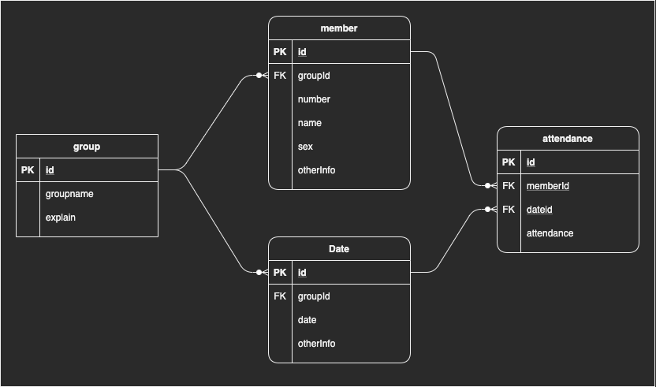

# 出欠確認アプリ

## 起動手順
### Step 0 Dockerのインストール
* Docker Desktopのインストール: https://docs.docker.com/get-docker/
* Dockerの確認（バージョン）
```
$ docker -v
```
### Step 1
```
$ docker-compose up
$ docker-compose exec web sh
$ npm install
$ npm db-sync
$ npm start
```

## テーブル構成


## URI設計

|メソッド|URI|詳細|
|-|-|-|
|GET|`/top`|トップページ|
|GET|`/group`|グループ全取得|
|GET|`/group/123`|グループ取得（id指定）|
|POST|`/group`|新規グループ作成|
|PUT|`/group/123/edit`|グループの更新|
|DELETE|`/group/123/del`|グループの削除|
|GET|`/group/123/attendance`|メンバー一覧取得、イベント一覧取得、出席一覧取得|
|GET|`/group/123/member/123`|メンバー取得（id指定）|
|GET|`/group/123/member`|メンバー作成ページへ|
|POST|`/group/123/member`|新規メンバー作成（依存する出席情報も作成）|
|GET|`/group/123/member/123/edit`|メンバー更新ページへ|
|PUT|`/group/123/member/123/edit`|メンバー更新|
|DELETE|`/group/123/member/123/del`|メンバー削除|
|GET|`/group/123/date/123`|イベント取得（id）|
|GET|`/group/123/date`|イベント作成ページ取得|
|POST|`/group/123/date`|イベント作成（依存する出席情報も作成）|
|GET|`/group/123/date/123`|イベント更新ページ取得|
|PUT|`/group/123/date/123`|イベント更新|
|DELETE|`/group/123/date/123`|イベント削除|
|PUT|`/group/123/date/123/attendance`|出席更新|

